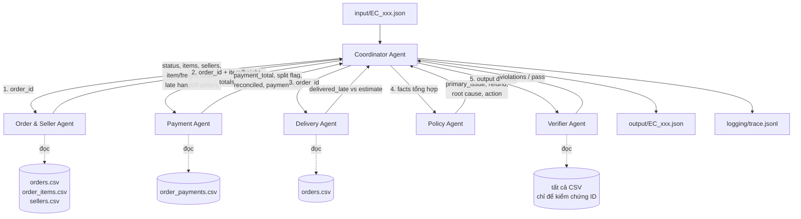

# Multi-Agent Architecture — E-commerce Dispute Resolution

## Tổng quan

Hệ thống điều tra 50 case khiếu nại trên dữ liệu Olist bằng 6 agent chuyên trách.
Mỗi agent chỉ được truy cập đúng domain dữ liệu của mình; mọi kết luận đi qua
handoff có cấu trúc và được Verifier kiểm chứng trước khi ghi file. Toàn bộ phép
tính tiền và so sánh timestamp là code Python thuần (deterministic); LLM chỉ dùng
để phân loại intent của khách hàng và ghi chú vào trace — model không bao giờ
tạo ra số liệu được chấm điểm.

## Model

| Thuộc tính | Giá trị |
| --- | --- |
| Model | `Qwen/Qwen2.5-1.5B-Instruct` (khai báo tại `shared/constants.py`) |
| Kích thước | 1.54B parameters (≤ 10B) |
| Framework | transformers (PyTorch), greedy decoding |
| Runtime | local (Apple Silicon MPS / CPU) |

## Sơ đồ agent và luồng handoff



## Vai trò và quyền truy cập dữ liệu

| Agent | File | Quyền dữ liệu | Nhiệm vụ |
| --- | --- | --- | --- |
| Coordinator | `agents/coordinator_agent.py` | không đọc CSV trực tiếp | Nhận case, phân loại intent (LLM), điều phối handoff, lắp ráp output |
| Order & Seller | `agents/order_seller_agent.py` | orders, order_items, sellers | Kiểm tra order tồn tại/trạng thái; item, seller, `item_total_brl`, `freight_total_brl`; so sánh `order_delivered_carrier_date` với từng `shipping_limit_date` → seller bàn giao muộn |
| Payment | `agents/payment_agent.py` | order_payments | Tổng payment (làm tròn 2 chữ số), đếm payment row, phát hiện split payment, đối soát với item+freight trong sai số 0.10 BRL, dựng `payment:<order>:<seq>` |
| Delivery | `agents/delivery_agent.py` | orders | So sánh `order_delivered_customer_date` với `order_estimated_delivery_date` |
| Policy | `agents/policy_agent.py` + `services/policy_engine.py` | không đọc CSV (chỉ nhận facts) | Áp dụng EC_POLICY_V1 theo đúng thứ tự ưu tiên, tính refund và action |
| Verifier | `agents/verifier_agent.py` | tất cả CSV (read-only) | Gate cuối: schema/caps/rounding, mọi evidence ID phải tồn tại trong CSV, refund khớp rule, `case_status` khớp refund |

## Thứ tự ưu tiên rule (EC_POLICY_V1)

1. `canceled_order_paid` → hoàn toàn bộ payment (platform)
2. `unavailable_order_paid` → hoàn toàn bộ payment (platform)
3. `late_delivery_seller` → hoàn freight (seller bàn giao sau shipping limit)
4. `late_delivery_logistics` → hoàn freight (carrier giao trễ dù seller đúng hạn)
5. `valid_split_payment` → 0, giải thích split payment hợp lệ
6. `unsupported_late_claim` → 0, bác bỏ khiếu nại giao trễ

## Nguyên tắc thiết kế

- **Deterministic core, LLM ở rìa**: số tiền, timestamp, evidence đều do code
  thuần tính; LLM (intent, narration) không thể làm sai output được chấm.
- **Facts-only policy**: Policy Agent không đọc CSV — chỉ quyết định trên facts
  các agent khác bàn giao, nên mọi kết luận truy vết được trong trace.
- **Verifier là hard gate**: output vi phạm (evidence không tồn tại, refund sai
  rule, quá cap) sẽ raise lỗi thay vì ghi file sai.
- **Không suy diễn dữ liệu không tồn tại**: Olist không có refund ledger,
  transaction ID hay tracking checkpoint → không bao giờ xuất hiện trong output.

## Trace

`logging/trace.jsonl` ghi một lượt chạy mới nhất (không append): `run_start`
(model metadata) → per case: `case_start`, `llm_intent`, các cặp
`handoff`/`finding` cho từng agent, `verify`, `case_complete` → `run_complete`
(phân bố primary issue, thời gian chạy).

## Chạy

```bash
python run_all.py             # 50 case, LLM intent bật
python run_all.py --case EC_004
python run_all.py --no-llm    # chỉ pipeline deterministic (CI/test)
python -m pytest tests/       # 43 tests
```